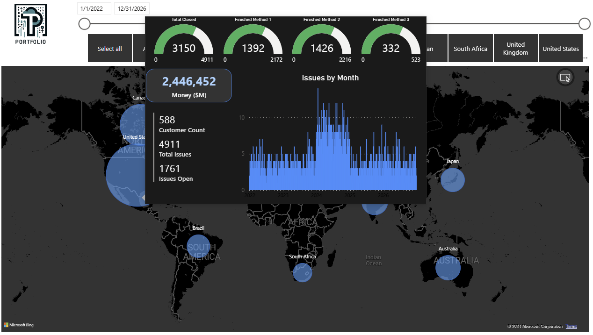
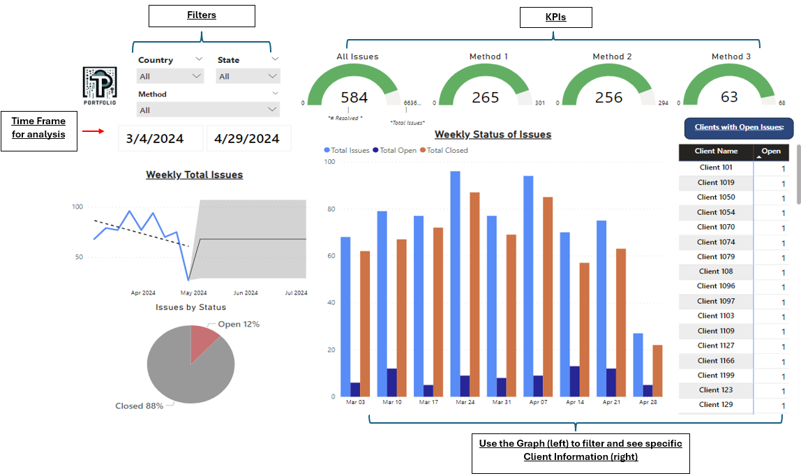
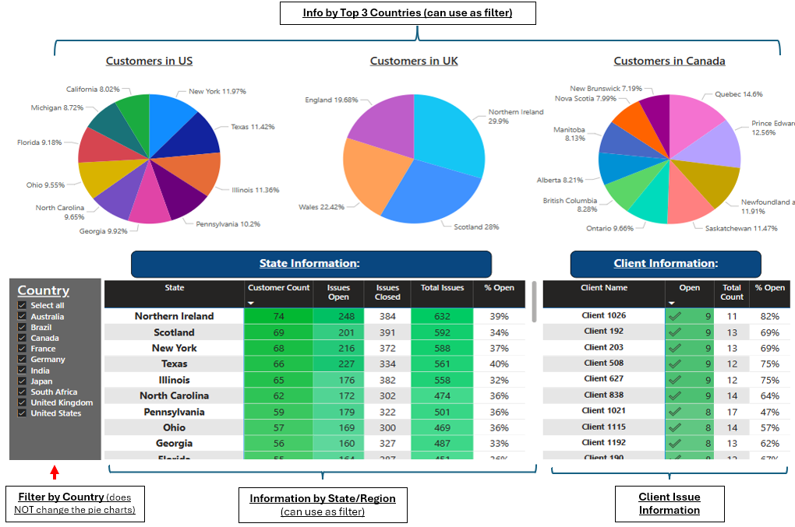
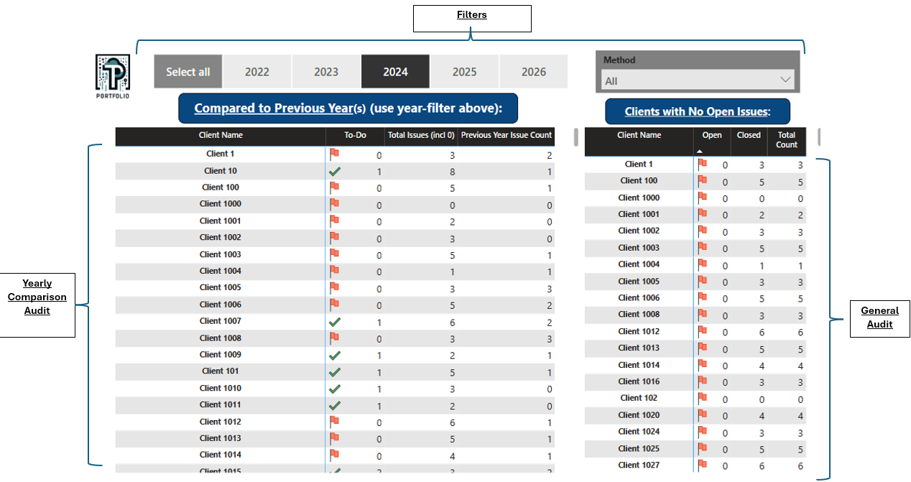

# Power BI Report - Analysis and Auditing 

## Project Overview
**This interactive Power BI report is tailored to executives and provides insights to the processes of the company. This report is a one-stop shop with several dashboards, each with a different purpose including high level analyses, in depth analysis, and auditing for either overall client/customer coverage or the "issues" data.** I also designed this report to be user friendly so that anybody will be able to intuitively navigate it and find their desired insights. 

This report has data points which can be translated to several things based on the company and its industry. For example:
- Depending on the context, "issues" can represent "requests", "tasks", "cases", etc. Each "issue" has an "Open" or "Closed" status
- Depending on the context, "money" can be represent "revenue", "AUM", etc.
- Depending on the context, there is a "Type" column with three "Methods", and the "Methods" can represent different products/services, divisions of the company, delivery method, and more. For example, for a retail company, "methods" can be changed to represent their eCommerce vs. physical store data. 

I created the dummy data through Python. Dataset Features include:
- 1200 clients with a unique Client ID
- 10,000 "issues" with a unique Issue ID. 35% of issues have an Open status and 65% having a have status
- Countries with clients/issues: 50% in US, 20% in UK, 15% in Canada, and 15% distributed evenly amongst Germany, Grance, Australia, Japan, India, Brazil, and South Africa. There's also specific states/regions within each country.

Software Used:
Power BI, Python, Excel

## High-Level Dashboards
I'll start by showcasing the dashboards that quickly provide high-level insights.

Below is the summary dashboard for **CLIENT COVERAGE**. It showcases key stats on the top, client coverage by month, client by coverage/issue type, clients by country, Money/Revenue by Country, and more. This is all interactive. For example, you can change the time frame or you can filter by a certain country by clicking on either the pie chart or matrix. 

Below is the summary dashboard for **ISSUES**. Similarly, It showcases key stats on the top, issues by month, issues by coverage/issue type, issues by country, and more. This is also all interactive.

Below is the dashboard with a map to visualize the global **CLIENT COVERAGE**. There are filters at the top to filter the time frame and the specific country. The map has bubbles that vary in size, which depends on the client count for the country. If you select or hover over a specific country, there is a tooltip that appears with key KPIs.

Below is the dashboard with a map to visualize the global **ISSUES** Similarly, there are filters at the top to filter the time frame and the specific country. The map's bubbles vary in size depending on the number of issues for the country. If you select or hover over a specific country, there is a tooltip that appears with key KPIs.

## In-Depth Analysis

Below is the dashboard that provides in-depth analysis for the **ISSUES**. There are KPIs and filters on the top. On the bottom bar graph, you can see the issues and their statuses on a weekly basis, and click on a specific week to filter on the table on the right to see the specific clients with those issues. 

Below is the dashboard that provides inights on the **state/region level**. There are pie charts on the top for the top 3 countries and tables on the bottom that provide information based on the specific state/region or client. There is also a filter on the bottom left to alter the data that shows on the tables. Again, this is all interactive so you can also click on the pie charts or tables to filter the data.   

## Auditing

Below is the dashboard that can be used to audit the data based on the context that it is used. On the left, you can compare the total issues or issues that are open to the previous years. This will allow you pinpoint clients that previously have many issues, but now do not. With this information you can investigate further. On the right, there is a more general audit, where you can see all clients with no open (or closed / total) issues. Depending on how you use this, you can find out which clients can be erased from the data base, have open issues, and more. 

